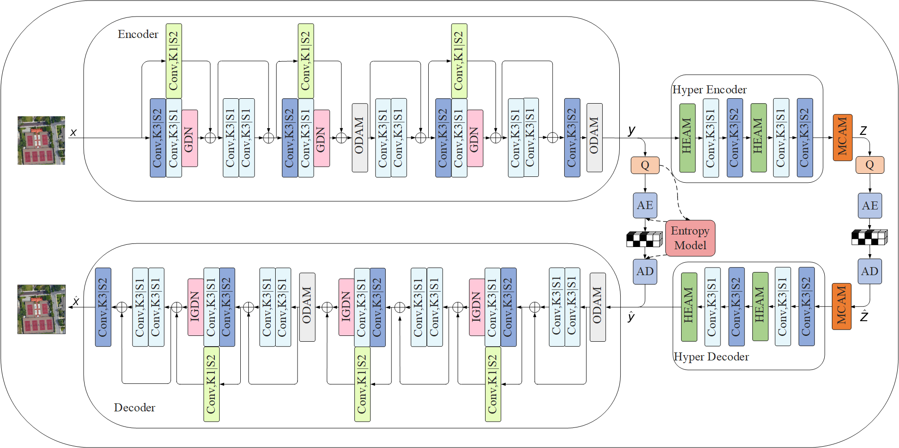

# A Feature Dynamic Enhancement and Global Collaboration Guidance Network for Remote Sensing Image Compression

This is the Pytorch repository of the paper "A Feature Dynamic Enhancement and Global Collaboration Guidance Network for Remote Sensing Image Compression".

## Abstract

Deep learning-based remote sensing image compression methods show great potential, but traditional convolutional networks mainly focus on local feature extraction and show obvious limitations in dynamic feature learning and global context modeling. Remote sensing images contain multiscale local features and global low-frequency information, which are challenging to extract and fuse efficiently. To address this, we propose a Feature Dynamic Enhancement and Global Collaboration Guidance Network (FDEGCNet). First, we propose an Omni-Dimensional Attention Model (ODAM), which dynamically captures the key salient features in the image content by adaptively adjusting the feature extraction strategy to enhance the model's sensitivity to key information. Second, a Hyperprior Efficient Attention Model (HEAM) is designed to combine multi-directional convolution and pooling operations to efficiently capture cross-dimensional contextual information and facilitate the interaction and fusion of multi-scale features. Finally, the Multi-Kernel Convolutional Attention Model (MCAM) integrates global branching to extract frequency domain context and enhance local feature representation through multi-scale convolutions. The experimental results show that FDEGCNet achieves significant improvement and maintains low computational complexity regarding image quality evaluation metrics (PSNR, MS-SSIM, LPIPS, and VIFp) on the three datasets compared to the advanced compression models.

## About

### The architecture of FDEGCNet



### Installation

The latest code has been tested on `Ubuntu 16.04 LTS, CUDA 10.1, PyTorch 1.2, and Python 3.7`. 

Please make sure to install the libraries provided in this repository.

```bash
pip install -r requirements.txt
```

### Usage

#### Training

An exemplary training script with a rate-distortion loss is provided in  `train.py`

```bash
python train.py --config examples/config_4096_256.json  --train /path/to/image/dataset/train/ --val /path/to/image/dataset/val/ --pretrain pretrain_model_path 
```

For high bitrate (1024, 2048, 4096), the out_channel_N is 256 and the out_channel_M is 256 in

`'config_1024_256.json', 'config_2048_256.json', 'config_4096_256.json'`

For low bitrate (128, 256, 512), the out_channel_N and the out_channel_M is 192 in
`''config_128_192.json', 'config_256_192.json', 'config_512_192.json'`

Each json file is at path `./examples/`.

`/path/to/image/dataset/train/` is the training data path.

`/path/to/image/dataset/val/` is the validation data path.

Finally， you can find you model files, log files and so on at path`./pretrain_model_path`

#### Testing

To test the trained model on its own dataset, the evaluation script is as follows:

```bash
python test.py --config examples/config_4096_256.json --pretrain pretrain_model_path  --val /path/to/image/dataset/test/
```

`/path/to/image/dataset/test/` is the testing data path.
`pretrain_model_path` is the final weight generated by training.

The rest of the definitions and training are the same

#### Citation

If you find this project useful for your research, please consider citing:

```bash
@article{gu2025fdegcet,
  title={A Feature Dynamic Enhancement and Global Collaboration Guidance Network for Remote Sensing Image Compression},
  author={Qizhi FANG, Shibo GU, Jingang WANG and Lili ZHANG},
  journal={Radioengineering},
  year={2025}
}
```
